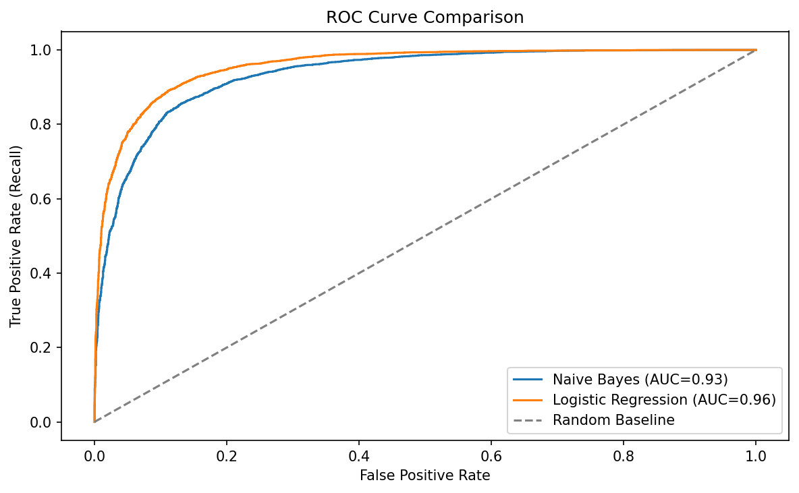

# IMDB Movie Review Sentiment Analysis

This project classifies IMDB movie reviews as positive or negative.

## Models

- Multinomial Naive Bayes
- Logistic Regression

## Workflow

1. Clean review text by lowercasing, removing HTML/special characters and stop words, and applying Porter stemming.
2. Split data into 80% training and 20% test data.
3. Create TF-IDF unigram and bigram features.
4. Train and evaluate both models with classification metrics and ROC-AUC.

## Data Leakage Prevention

TF-IDF is fitted only on training data. The test data remains unseen until evaluation.

```python
x_train_tfidf = tfidf.fit_transform(x_train)
x_test_tfidf = tfidf.transform(x_test)
```

## Results



Logistic Regression achieved ROC-AUC of approximately **0.96**, compared with approximately **0.93** for Naive Bayes.

### Top 10 Positive Words

`excel`, `perfect`, `great`, `brilliant`, `enjoy`, `favorit`, `amaz`, `hilari`, `superb`, `today`

### Top 10 Negative Words

`worst`, `aw`, `wast`, `bore`, `bad`, `terribl`, `poor`, `disappoint`, `fail`, `dull`

> Terms are stemmed during preprocessing, so some words appear shortened.

## Requirements

```bash
pip install pandas scikit-learn matplotlib nltk
```

## Run

Open `movie_review.ipynb` and run all cells.